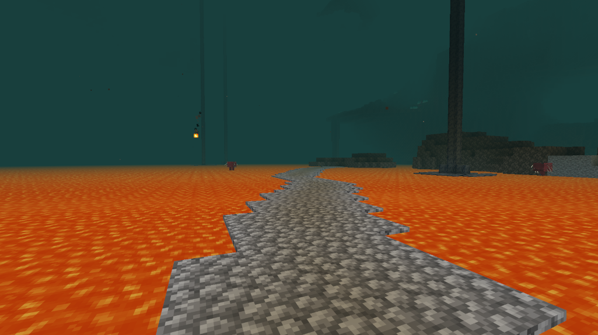

# Lava Walker

A Fabric mod for Minecraft 1.21.11 that adds the **Lava Walker** enchantment.

## Features

**Lava Walker** works like Frost Walker, but for lava - walk across lava lakes by turning lava source blocks into cobblestone beneath your feet.

- Enchantment for boots
- Converts lava source blocks to cobblestone when walking nearby
- Small 2-block radius for balance
- Cobblestone is permanent (unlike Frost Walker's ice)
- Treasure enchantment (found in loot, not enchanting table)
- Mutually exclusive with Frost Walker and Depth Strider

## Screenshot

## Requirements

- Minecraft 1.21.11
- Fabric Loader 0.18.1+
- Fabric API

## Installation

**Server-side only** - clients don't need the mod installed.

1. Install [Fabric Loader](https://fabricmc.net/use/) on your server
2. Install [Fabric API](https://modrinth.com/mod/fabric-api)
3. Drop `lava-walker-x.x.x.jar` into your server's `mods` folder

Uses [Polymer](https://modrinth.com/mod/polymer) to serve translations to vanilla clients.

## License

MIT License - see [LICENSE](LICENSE)
