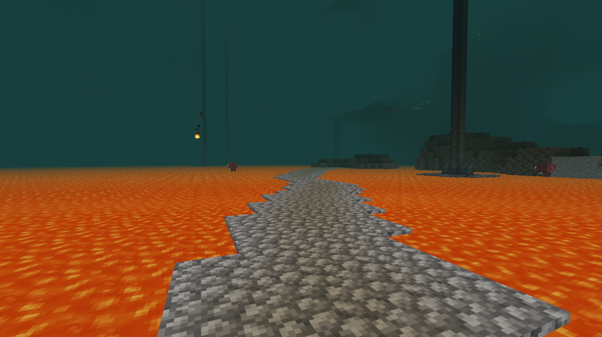

# Lava Walker

A Fabric mod that adds the **Lava Walker** enchantment.

## Features

**Lava Walker** works like Frost Walker, but for lava - walk across lava lakes by turning lava source blocks into cobblestone beneath your feet.

- Enchantment for boots
- Converts lava source blocks to cobblestone when walking nearby
- Small 2-block radius for balance
- Cobblestone is permanent (unlike Frost Walker's ice)
- Treasure enchantment (found in loot, not enchanting table)
- Mutually exclusive with Frost Walker and Depth Strider

## Screenshot

## Requirements

- Targets the Minecraft, Fabric Loader, and Fabric API versions declared in this mod's `gradle.properties`; check there for the exact currently-supported version
- Java version as declared in `fabric.mod.json`'s `depends` block

## Pandorical

Lava Walker requires the Pandorical mod on the server: it registers its own assets (translations and related resources) through Pandorical's content sync so Pandorical-enabled clients see them correctly, and the mod won't load without it. The enchantment mechanic itself doesn't depend on any Pandorical-specific feature beyond that asset sync.

## Installation

**Server-side only** - clients don't need this mod installed to be affected by the enchantment.

1. Install [Fabric Loader](https://fabricmc.net/use/) on your server
2. Install [Fabric API](https://modrinth.com/mod/fabric-api)
3. Drop the Lava Walker jar into your server's `mods` folder

## License

MIT License - see [LICENSE](LICENSE)
